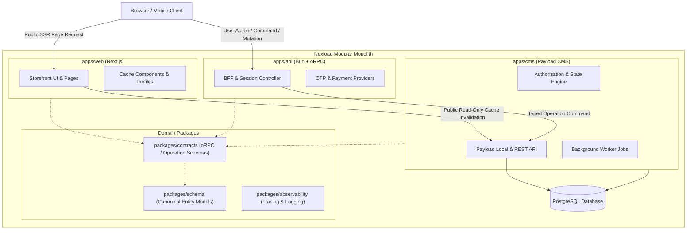

# The Nexload Modular Monolith Architecture

This document articulates the architectural philosophy of the **Nexload Modular Monolith** and explains how `nexload-sdk` serves as its decoupled toolbelt, contract foundation, and cognitive reasoning layer.

---

## 1. The Monolith Problem and the Microservices Trap

Modern enterprise full-stack applications often fall into one of two extremes:
1. **The Tangled Monolith:** A single Next.js or Node repository where database queries, business transactions, frontend rendering, and payment gateways are intermingled without boundaries. Changes to database schemas leak directly into frontend props; authorization is scattered across random server components; local development becomes fragile.
2. **The Microservices Tax:** Prematurely splitting an application into 10+ independent repositories and containerized services. Teams spend more time managing network latency, eventual consistency, Docker networking, API version negotiation, and duplicated DTOs than building product features.

**Nexload** was engineered as an intentional middle path: **The Modular Monolith**.

---

## 2. The Nexload Architecture Triad

As demonstrated in applications like `nexload-e-commerce`, a Nexload system is organized as a single, coordinated monorepo containing three specialized application roles and shared domain packages:



### Architectural Roles:
1. **`apps/web` (Next.js App Router):**
   - **Owns:** Route layout, client rendering, URL state, browser caching headers, responsive design.
   - **Does NOT own:** Database connections, business state transactions, payment logic.
2. **`apps/api` (Bun + oRPC BFF):**
   - **Owns:** Browser command ingestion, cookie sessions, OTP generation/verification, payment gateway integrations, rate limiting.
   - **Does NOT own:** Direct database queries, collection definitions, persistence state.
3. **`apps/cms` (Payload CMS + PostgreSQL):**
   - **Owns:** The authoritative source of persistence truth, collection definitions, transactional state machines, data integrity, access control, and asynchronous background jobs.
   - **Does NOT own:** Public end-user sessions, direct payment provider webhooks, customer frontend rendering.

---

## 3. Why `nexload-sdk` Was Extracted

As Nexload projects grew, several structural challenges emerged:

1. **Heterogeneous Runtimes:**
   The stack operates across Node.js (in Payload/CMS), Bun (in high-throughput API/BFF), and Next.js (in Web). Each needed health checking, memory observation, and readiness probes, but maintaining separate probe code in each app created inconsistencies.
2. **Contract Sharing vs. Data Leaks:**
   BFF (`apps/api`) needed to execute custom business transactions against CMS (`apps/cms`). Exposing Payload Local API directly to another process was impossible without network boundaries, but hand-rolling REST endpoints caused type divergence.
3. **Payload CMS Ergonomics:**
   Payload is powerful, but lacked out-of-the-box support for specialized requirements:
   - Non-ASCII/Unicode slug generation (e.g., Persian/Arabic slugs).
   - Jalali (Solar Hijri) calendar inputs in the Admin UI.
   - Integer minor-unit currency handling (avoiding floating point inaccuracies in Tomans/Rials).
   - Composable Lexical editor presets.
4. **Cognitive Reasoning for AI Agents:**
   AI agents working on complex enterprise codebases often jump straight into writing code, producing fragmented changes. A structured cognitive graph was needed to enforce discovery, investigation, ideation, design, and execution phases.

`nexload-sdk` was extracted to solve these challenges once, at production quality, with full test coverage and semantic versioning.

---

## 4. How `nexload-sdk` Maps to the Monolith Layers

```text
+-----------------------------------------------------------------------------------------+
|                                    NEXLOAD STACK                                        |
+-----------------------------------------------------------------------------------------+
|                                                                                         |
|  [apps/web (Next.js)]       <--- @nexload-sdk/healthcheck-next                          |
|                             <--- @nexload-sdk/env                                       |
|                             <--- @nexload-sdk/payload-operations (Client SDK Facade)   |
|                                                                                         |
|  [apps/api (Bun + oRPC)]    <--- @nexload-sdk/healthcheck-bun                           |
|                             <--- @nexload-sdk/env                                       |
|                             <--- @nexload-sdk/logger                                    |
|                             <--- @nexload-sdk/payload-operations (Operation Client)    |
|                                                                                         |
|  [apps/cms (Payload CMS)]   <--- @nexload-sdk/payload-schema                            |
|                             <--- @nexload-sdk/payload-operations (Endpoint Engine)     |
|                             <--- @nexload-sdk/payload-fields (slug, jalali, money)      |
|                             <--- @nexload-sdk/payload-editor (lexical presets)          |
|                             <--- @nexload-sdk/payload-hooks (operation logging)         |
|                             <--- @nexload-sdk/healthcheck-payload                       |
|                             <--- @nexload-sdk/healthcheck-node                          |
|                                                                                         |
|  [packages/contracts]       <--- @nexload-sdk/payload-operations (Contract Definitions)|
|  [packages/schema]          <--- @nexload-sdk/payload-schema (Canonical Schema Types)   |
|                                                                                         |
+-----------------------------------------------------------------------------------------+
|                                  CROSS-CUTTING PLATFORM                                 |
+-----------------------------------------------------------------------------------------+
|  Observability              <--- @nexload-sdk/healthcheck-prometheus, -otel             |
|  Workspace Tooling          <--- @nexload-sdk/bundler, -eslint-config, -typescript-config|
|  AI Engineering Reasoning   <--- nexload-reasoning (6+1 Cognitive Graph)                |
|  Engineering Standards      <--- nexload-code, -package, -react, -design, -cto-review   |
+-----------------------------------------------------------------------------------------+
```

---

## 5. Design Principle: Loose Coupling, High Cohesion

Every package in `nexload-sdk` adheres strictly to two architectural guarantees:

1. **Independent Utility:**
   No package enforces a hard dependency on the Nexload monolith.
   - `@nexload-sdk/healthcheck` can be used in an Express or Fastify microservice.
   - `@nexload-sdk/env` can be used in a vanilla Node script.
   - `@nexload-sdk/payload-fields` can be installed in any vanilla Payload CMS project.
2. **Synergistic Cohesion:**
   When assembled within the Nexload Modular Monolith, these packages eliminate glue code, standardize error shapes, align validation pipelines, and provide complete end-to-end type safety from database field to browser form.
