# Package Overview & Inventory

This document provides the authoritative inventory matrix and dependency graph for all packages contained in `nexload-sdk`.

---

## Workspace Package Matrix

| Package Name | Monorepo Path | Role & Domain | Runtime Target | Status |
| --- | --- | --- | --- | --- |
| **`@nexload-sdk/healthcheck`** | `packages/healthcheck/core` | Core healthcheck manager, check runner, report aggregator | Isomorphic (Node, Bun, Browser) | Implemented |
| **`@nexload-sdk/healthcheck-node`** | `packages/healthcheck/node` | Node.js process stats, Linux cgroups, TCP reachability, DNS | Node.js (>=20) | Implemented |
| **`@nexload-sdk/healthcheck-bun`** | `packages/healthcheck/bun` | Bun runtime identification & `Bun.serve` probe adapter | Bun (>=1.1) | Implemented |
| **`@nexload-sdk/healthcheck-next`** | `packages/healthcheck/next` | Next.js App Router route handlers (`no-store`, JSON/Prometheus) | Next.js (>=15) | Implemented |
| **`@nexload-sdk/healthcheck-prometheus`** | `packages/healthcheck/prometheus` | Prometheus & OpenMetrics plain text serializer | Isomorphic | Implemented |
| **`@nexload-sdk/healthcheck-otel`** | `packages/healthcheck/otel` | OpenTelemetry metric record & resource attribute mapper | Isomorphic | Implemented |
| **`@nexload-sdk/healthcheck-payload`** | `packages/healthcheck/payload` | Payload CMS Local API ping and database readiness probe | Node.js (Payload >=3) | Implemented |
| **`@nexload-sdk/payload-schema`** | `packages/payload-schema` | Canonical field definitions compiled to Payload & Zod | Isomorphic | Implemented |
| **`@nexload-sdk/payload-operations`** | `packages/payload-operations` | Contract-first custom operations, endpoints & client SDK | Node.js / Isomorphic Client | Implemented |
| **`@nexload-sdk/payload-editor`** | `packages/payload-editor` | Semantic presets & feature builder for Payload Lexical | Node.js / React UI | Implemented |
| **`@nexload-sdk/payload-fields`** | `packages/refactoring/payload-fields` | Semantic fields: Unicode slug, Jalali date, integer money | Node.js / React 19 UI | Implemented |
| **`@nexload-sdk/payload-hooks`** | `packages/payload-hooks` | Type-safe collection operation logging hooks | Node.js (Payload >=3) | Implemented |
| **`@nexload-sdk/env`** | `packages/refactoring/env` | Type-safe environment variable manager & validation presets | Isomorphic / Node / Bun | Implemented |
| **`@nexload-sdk/logger`** | `packages/refactoring/logger` | Structured leveled logger with color formatting & child tags | Isomorphic / Node / Bun | Implemented |
| **`@nexload-sdk/bundler`** | `tools/bundler` | Workspace build runner: esbuild dual ESM/CJS & dts generator | Node.js CLI / Tooling | Internal Tooling |
| **`@nexload-sdk/eslint-config`** | `tools/eslint-config` | Shared ESLint 9 flat config for TypeScript & React | Tooling | Internal Tooling |
| **`@nexload-sdk/typescript-config`** | `tools/typescript-config` | Base `tsconfig.json` configurations (Node, DOM, Library) | Tooling | Internal Tooling |

---

## Inter-Package Dependency Graph

```mermaid
graph TD
    Logger["@nexload-sdk/logger"]
    Env["@nexload-sdk/env"]
    HealthCore["@nexload-sdk/healthcheck"]
    Bundler["@nexload-sdk/bundler"]
    
    %% Internal tooling deps
    Bundler -.->|Builds all packages| HealthCore
    Bundler -.->|Builds all packages| Logger
    Bundler -.->|Builds all packages| Env
    
    %% Env uses Logger
    Env --> Logger
    
    %% Healthcheck suite
    HealthNode["@nexload-sdk/healthcheck-node"] --> HealthCore
    HealthBun["@nexload-sdk/healthcheck-bun"] --> HealthCore
    HealthNext["@nexload-sdk/healthcheck-next"] --> HealthCore
    HealthProm["@nexload-sdk/healthcheck-prometheus"] --> HealthCore
    HealthOtel["@nexload-sdk/healthcheck-otel"] --> HealthCore
    HealthPayload["@nexload-sdk/healthcheck-payload"] --> HealthCore
    
    %% Payload suite
    PayloadHooks["@nexload-sdk/payload-hooks"] --> Logger
    PayloadFields["@nexload-sdk/payload-fields"]
    PayloadEditor["@nexload-sdk/payload-editor"]
    PayloadSchema["@nexload-sdk/payload-schema"]
    PayloadOps["@nexload-sdk/payload-operations"]
```

---

## External Ecosystem References

The following packages are referenced by client apps in the wider Nexload ecosystem (e.g., `nexload-e-commerce`), but are not located in this repository:
- **`@nexload-sdk/jwt`:** Lightweight, secure JWT signing and verification utility designed for Bun BFF edge runtimes. Maintained in a separate repository.
