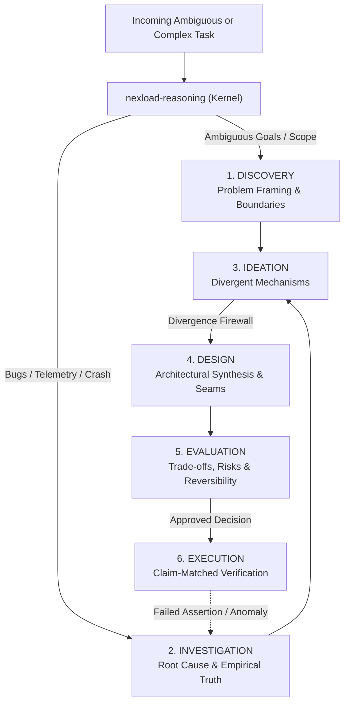

# The 6+1 Cognitive Graph Reasoning Ecosystem

This document details the architectural foundation and operating principles of the **Nexload Cognitive Reasoning Ecosystem** (`nexload-reasoning-*`).

---

## 1. Executive Summary

The reasoning ecosystem consists of **one kernel router** and **six cognitively distinct specialists**:

```text
nexload-reasoning (Kernel Router & Depth Controller)
├── nexload-reasoning-discovery       (What problem are we actually solving?)
├── nexload-reasoning-investigation   (What is actually true / happening, and why?)
├── nexload-reasoning-ideation        (What materially different possibilities exist?)
├── nexload-reasoning-design          (How could a selected direction coherently work?)
├── nexload-reasoning-evaluation      (Which direction should we choose?)
└── nexload-reasoning-execution       (How do we turn the approved direction into verified reality?)
```

Unlike linear pipelines or monolithic prompts, the 6+1 Cognitive Graph enforces cognitive separation of concerns. An agent must not design before understanding root cause; an agent must not execute before resolving trade-offs.

---

## 2. The Cognitive Graph Topology



---

## 3. The 6 Specialists in Detail

### 1. `nexload-reasoning-discovery`
- **Cognitive Question:** *What problem are we actually solving?*
- **Intent:** Extracts actual business/user intent, decomposes fuzzy requests, establishes explicit scope boundaries, and gates premature technical decisions.
- **When to Use:** Greenfields, ambiguous stakeholder requests, user solutions disguised as technical requirements.
- **Do NOT Use For:** Investigating known runtime crashes or implementing settled plans.

### 2. `nexload-reasoning-investigation`
- **Cognitive Question:** *What is actually true / happening, and why?*
- **Intent:** Empirical truth-finding, causal modeling, hypothesis testing, telemetry discrimination, and systematic debugging.
- **When to Use:** Runtime exceptions, performance regressions, contradictory data, race conditions.
- **Do NOT Use For:** Brainstorming feature ideas or designing clean-slate architectures.

### 3. `nexload-reasoning-ideation`
- **Cognitive Question:** *What materially different possibilities exist?*
- **Intent:** Divergent mechanism generation, exploring fundamentally distinct architectural strategies, escaping cognitive fixation.
- **When to Use:** Overcoming technical bottlenecks, exploring novel alternatives.
- **Do NOT Use For:** Converging on a single choice or writing implementation plans.

### 4. `nexload-reasoning-design`
- **Cognitive Question:** *How could a selected direction coherently work?*
- **Intent:** Architectural synthesis, bounded contexts, single source of truth (SSOT) allocation, interface contracts, state ownership, and failure paths.
- **When to Use:** Structuring an approved direction into clean components and seams.
- **Do NOT Use For:** Unconstrained brainstorming or task-by-task execution.

### 5. `nexload-reasoning-evaluation`
- **Cognitive Question:** *Which direction should we choose?*
- **Intent:** Convergent decision-making, Pareto option pruning, material trade-off analysis, pre-mortem stress testing, and reversibility assessment (Type 1 vs. Type 2 decisions).
- **When to Use:** Choosing between competing architectural designs, libraries, or infrastructure strategies.
- **Do NOT Use For:** Brainstorming or writing execution code.

### 6. `nexload-reasoning-execution`
- **Cognitive Question:** *How do we turn the approved direction into a verified result?*
- **Intent:** Structured phase-by-phase implementation, autonomous delivery, claim-matched verification, and intelligent failure recovery routing.
- **When to Use:** Implementing an approved design or applying database migrations.
- **Do NOT Use For:** Re-debating settled architectural decisions.

---

## 4. Key Architectural Invariants

### The Divergence Firewall
In standard LLM interactions, ideation quickly collapses into premature commitment to the first plausible solution. The **Divergence Firewall** strictly prevents ideation from evaluating or executing options in the same step. Divergent options must be explicitly generated, then formally evaluated against trade-offs.

### Stopping Discipline
Reasoning depth must match task complexity. The kernel dynamically chooses depth:
- **Trivial / Direct Tasks:** Skip directly to execution or single-tool calls.
- **Standard Tasks:** Discovery → Design → Execution.
- **High-Stakes / Complex Tasks:** Full 6-stage traversal with explicit checkpoints.

### Standalone Capability
Every specialist skill is completely standalone-capable. It can be invoked directly by name without going through the kernel if the task cleanly targets its domain.
